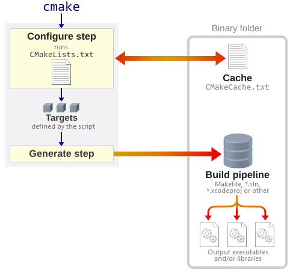
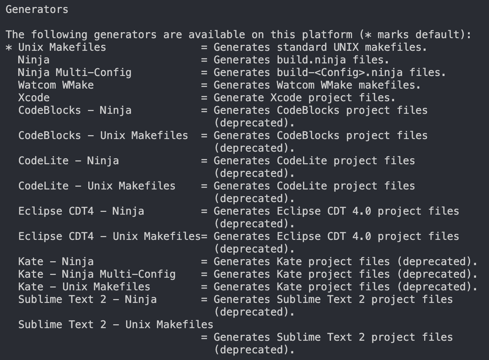
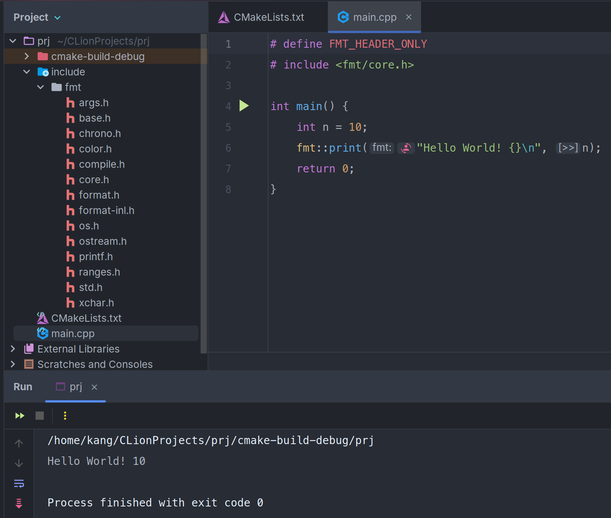
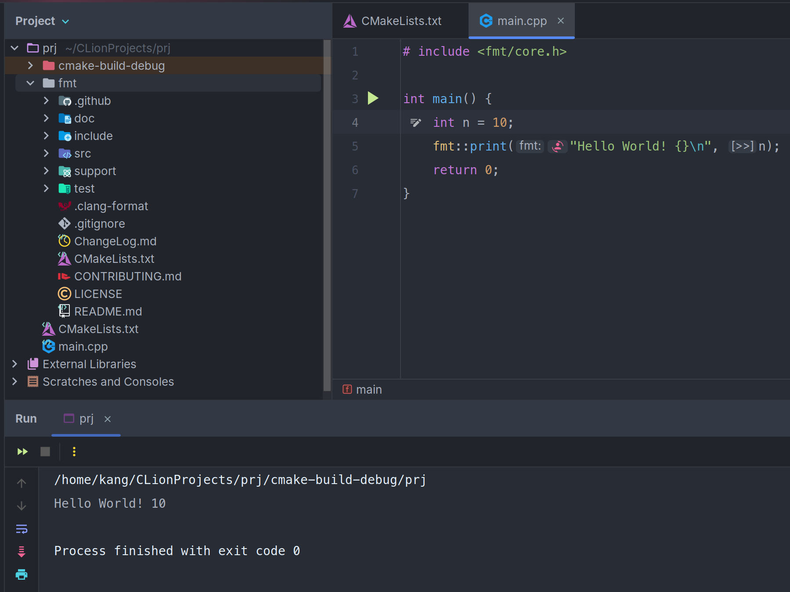
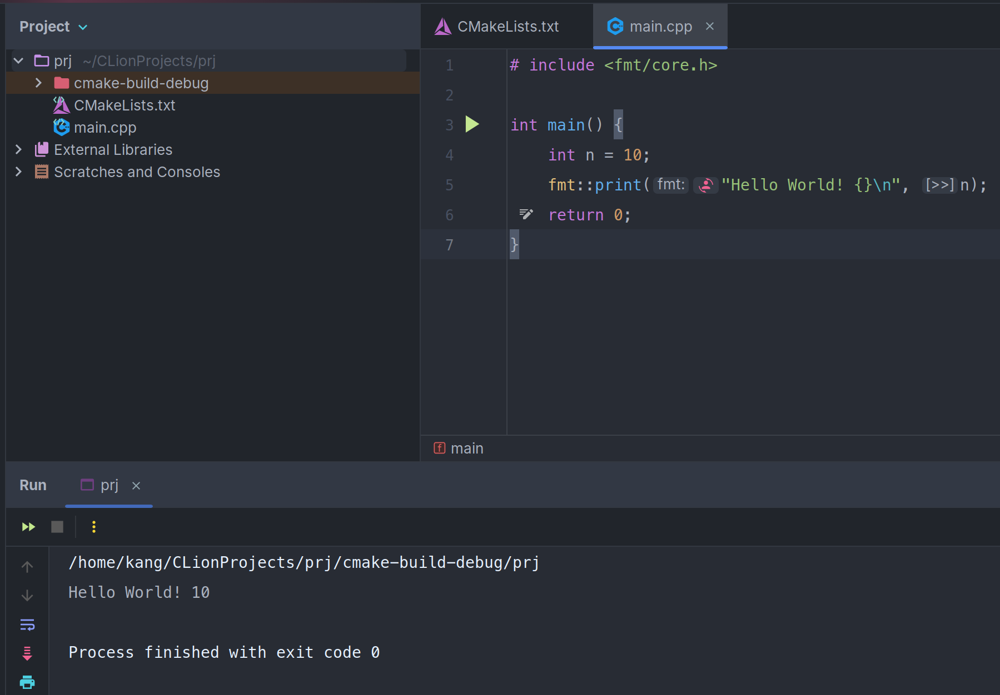

# CMake 入门
> [!note]
> 学习这一篇的内容，需要你对以下技能有基本的了解：
> * Make 入门（请参考[这篇文档](./intro-make.md)） 
> 
> 更重要的是，用过 Make 后，你更能体会到 CMake 带来的便利。

随着项目规模扩大，代码文件数量增多，单靠手写 Makefile 变得繁琐且难以维护。而 CMake 是一个跨平台的构建工具，可以生成不同平台、不同工具链所需的 Makefile 或工程文件，是目前 C/C++ 项目的主流构建配置方式。与 Make 类似，利用 CMake 时，我们需要编写的配置文件为 `CMakeLists.txt`。

学习 CMake 能帮助你：
- 简化多文件项目的配置
- 跨平台构建（Linux、Windows、Mac）
- 管理大型项目和第三方库

## 安装 CMake
如果你使用 GNU/Linux（包括 WSL），一般可以直接安装 CMake。比如在 Ubuntu 中，如下：

```bash
sudo apt install cmake
```

如果你使用 MacOS，可以使用 brew 安装。

```bash
brew install cmake
```

如果你使用 Windows，可以在[官网](https://cmake.org/download/)下载二进制包或者使用 Chocolatey 等包管理器下载。

下面打开终端，键入：

```plain
$ cmake --version
cmake version 4.0.1

CMake suite maintained and supported by Kitware (kitware.com/cmake).
```

看到上面这样的文字证明你的安装是正确的。

## 一个简单的示例

假设我们有一个 C 语言项目，目录结构如下：

```
project/
├── main.c
├── hello.c
├── hello.h
└── CMakeLists.txt
```

我们希望生成一个可执行文件 main。`CMakeLists.txt` 文件内容如下：

```cmake
cmake_minimum_required(VERSION 3.15)
project(HelloProject LANGUAGES C)
# 编译产物为可执行文件，并指定需要编译的源文件
add_executable(main main.c hello.c)
```

然后在项目根目录运行：

```bash
cmake -B build
cmake --build build
```

执行完成后，你会在 `build/` 目录里看到生成的可执行文件。

在这个示例中，对比直接编写 `Makefile`，使用 `CMakeLists.txt` 更加简洁。

## CMake 的构建流程

CMake 是“配置 + 构建”两步走的：



```bash
# 第一步：配置，生成构建系统（例如 Makefile）
cmake -B build

# 第二步：构建
cmake --build build -j4

# （可选）安装
sudo cmake --build build --target install

# 清理
sudo cmake --build build --target clean
```

### 配置阶段的参数

`-B build` 表示把中间文件、构建文件放在 `build/` 目录。

`-G` 指定生成器，`CMake` 可以生成不同类型的构建系统（比如 `Makefile` `MSBuild`，所以可以跨平台）  

```bash
cmake -B build -G "Unix Makefiles"
```



安装路径、构建类型等选项在配置阶段通过 `-D` 参数指定。

```bash
# 设置安装路径
cmake -B build -DCMAKE_INSTALL_PREFIX=/opt/myapp
# 设置构建模式为发布模式
cmake -B build -DCMAKE_BUILD_TYPE=Release           
```

## CMakeLists.txt 基本语法

CMake 通过一个名为 `CMakeLists.txt` 的文件定义构建规则。常见语法如下：

### 定义项目/约束CXX标准

```cmake
# 规定 CMake 最低版本要求
cmake_minimum_required(VERSION 3.15)

# 规定 C++ 最低标准
set(CMAKE_CXX_STANDARD 17)
set(CMAKE_CXX_STANDARD_REQUIRED ON)
set(CMAKE_CXX_EXTENSIONS OFF)

# 定义项目
project(prj LANGUAGES C CXX)
```

### 生成可执行程序

目标产物为可执行文件时，使用 `add_executable`。

```cmake
add_executable(main main.cpp hello.cpp)

# 先指定可执行程序，后添加
add_executable(main)
target_sources(main PUBLIC main.cpp hello.cpp)

# 使用 GLOB 根据扩展名批量查找，替换成 GLOB_RECURSE 则会递归所有子文件夹中进行匹配，CONFIGURE_DEPENDS 保证增减文件后自动更新变量
add_executable(main)
file(GLOB sources CONFIGURE_DEPENDS *.cpp *.h)
target_sources(main PUBLIC ${sources})
```

### 生成库

目标产物为库文件时，使用 `add_library`。

```cmake
# 静态库
add_library(mylib STATIC mylib.cpp)

# 动态库
add_library(mylib SHARED mylib.cpp)

# OBJ库
add_library(mylib OBJECT mylib.cpp)
```

### 目标属性

CMake 提供了很多方便的命令管理 target 的属性，这里的 target 就是前文提到的目标产物。比如：

```cmake
target_sources(myapp PUBLIC hello.cpp other.cpp)    # 添加源文件 
target_include_directories(myapp PUBLIC include)    # 添加头文件搜索目录
target_link_libraries(myapp PUBLIC hellolib)        # 添加链接库
target_add_definitions(myapp PUBLIC -DMY_MACRO=1)   # 添加宏定义 MY_MACRO=1
target_compile_options(myapp PUBLIC -fopenmp)       # 添加编译选项
```

这些命令只对指定的 target 生效，而不会影响全局。

相对地，以下命令则会改变全局配置，在 CMake 中要谨慎使用。

```cmake
# 避免使用
include_directories(include)      # 添加头文件搜索目录
link_directories(/opt/cuda)       # 添加链接库搜索目录
add_definitions(MY_MACRO=1)       # 添加宏定义 MY_MACRO=1
add_compile_options(-fopenmp)     # 添加编译选项
```

## 第三方库引入方法

### 作为纯头文件引入 `target_include_directories`

适用于那些只有头文件的库，例如一些轻量级的模板库。这些库不需要编译，因为它们的实现代码都在头文件中，通常是通过模板或者宏等方式实现功能。比如C++的标准模板库就是纯头文件。

以 `fmt` 库为例，该库介绍说明可以通过纯头文件引入，此时只需要项目中的 `include` 文件夹。



在 `CMakeLists.txt` 中通过 `target_include_directories` 引入第三方库头文件目录。

```CMake
cmake_minimum_required(VERSION 3.15)
project(prj)

set(CMAKE_CXX_STANDARD 17)

add_executable(prj main.cpp)
target_include_directories(prj PUBLIC include)
```

但是直接引入头文件，函数实现在头文件里，没有提前编译，每次需要重复编译同样的内容，编译时间长。

### 作为子模块引入 `add_subdirectory`

这种方式将第三方库的源代码直接包含到项目中，第三方库通常有自己的 `CMakeLists.txt` 文件，通过 `add_subdirectory` 指令，可以将这个库的构建过程集成到主项目的构建过程中。

以 `fmt` 库为例，这个开源库可以直接将该项目作为用户项目的子项目引入。



在 `CMakeLists.txt` 中通过 `add_subdirectory` 引入第三方库的项目子目录，再通过 `target_link_libraries` 链接第三方项目库。

```CMake
cmake_minimum_required(VERSION 3.15)
project(prj)

set(CMAKE_CXX_STANDARD 17)

add_subdirectory(fmt)

add_executable(prj main.cpp)
target_link_libraries(prj fmt::fmt)
```

### 引用系统中安装的第三方库 `find_package`

在存在菱形依赖的情况下，即项目A依赖于B和C，而B和C又同时依赖于D，使用子模块引用（`add_subdirectory`），可能会导致D被定义两遍，从而引发错误。

而通过 `find_package` 使用系统预安装的库则可以有效避免这个问题。当使用 `find_package` 查找库时，CMake会记录已经找到的库。因此，即使多个模块依赖同一个库， `find_package` 也只会引入一次。

不同操作系统可以通过各自的包管理器来安装所需的库。以Ubuntu为例，可以使用 `apt` 包管理器来安装库。比如安装 `fmt` 库：

```sh
sudo apt install libfmt-dev
```

此时由于头文件等已经在系统查找路径中（比如`/usr/include`），可以直接在文件中导入相关的头文件，此时，项目结构如下：



在 `CMakeLists.txt` 中则需要先 `find_package` 找到 `fmt` 包，再通过 `target_link_libraries` 链接第三方项目库。

```CMake
cmake_minimum_required(VERSION 3.15)
project(prj)

set(CMAKE_CXX_STANDARD 17)

find_package(fmt)

add_executable(prj main.cpp)
target_link_libraries(prj fmt::fmt)
```

在CMake中，一个项目可以包含多个库。CMake允许一个包（package）提供多个库，这些库也被称为组件（components）。因此，在使用 `target_link_libraries` 指令链接库时，应采用 `包名::组件名` 的格式。  

例如，在上文中提到的 `fmt::fmt`，其中 `fmt` 是包名，第二个 `fmt` 是该包提供的一个组件名。

## 结语

CMake 作为当今最流行的跨平台构建工具之一，功能强大、生态完善，是绝大多数 C++ 项目的首选。

然而，CMake 的语法和配置方式对于初学者来说略显繁琐。近年来也有一些更现代化、上手更简单的构建工具涌现，比如 [xmake](https://xmake.io/)，它用更直观的语法封装了很多常用场景，这里限于篇幅就不再介绍了。

